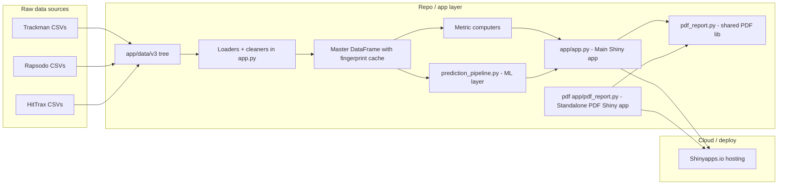
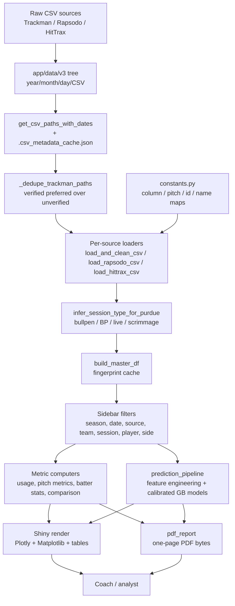

# Purdue Softball Visualization App — Project Handoff & Review Document

**Prepared for:** Kate Claypool (Softball Director of Player Development)
**Audience:** Mixed technical and non-technical stakeholders
**Purpose:** Consolidated handoff and review document covering the full project — code, data pipelines, documentation, meeting history, and open work.

---

## Table of Contents

1. [Project Overview](HANDOFF.md#project-overview)
2. [System / Repository Overview](HANDOFF.md#system-repository-overview)
3. [File and Folder Map](HANDOFF.md#file-and-folder-map)
4. [Detailed Code Documentation by Component](HANDOFF.md#detailed-code-documentation-by-component)
5. [Feature-to-Code Mapping](HANDOFF.md#feature-to-code-mapping)
6. [Meeting Notes Integration](HANDOFF.md#meeting-notes-integration)
7. [Data Flow and Logic Summary](HANDOFF.md#data-flow-and-logic-summary)
8. [Known Gaps, Open Questions, and Future Improvements](HANDOFF.md#known-gaps-open-questions-and-future-improvements)
9. [Handoff Summary](HANDOFF.md#handoff-summary)

---

<a id="project-overview"></a>
## 1. Project Overview

### What this project is

The Purdue Softball Visualization App is a Shiny-based analytics platform that turns raw pitch-by-pitch and at-bat data from Purdue's three primary tracking systems — **Trackman**, **Rapsodo**, and **HitTrax** — into interactive dashboards, coach-ready one-page PDF reports, and a league-trained machine-learning recommendation layer.

Two Python applications make up the user-facing software:

- A main **interactive Shiny dashboard** for pitcher and batter exploration, game-by-game comparison, and predictive analytics.
- A standalone **PDF report Shiny app** that accepts a single Trackman CSV upload and outputs a one-page profile PDF.

A shared PDF-generation Python module sits behind both so report output stays consistent regardless of entry point.

### Main goals of the system

- Replace manual post-game CSV inspection with an integrated, filterable dashboard.
- Give coaches quick pitcher profiles (usage, location, movement) and batter profiles (plate discipline, zone, spray, exit velocity).
- Provide league-context pitch-level predictions (strike reliability, put-away potential, hard-contact risk) via a gradient-boosted ML layer.
- Deliver printable one-page scouting / development PDFs for use during practices and games.
- Future-proof the tool so a new analyst or coach can pick it up in later seasons without re-building.

### Main components

| Component | Role |
| --- | --- |
| Main Shiny dashboard | Filterable live exploration of all sources, predictions, and in-app PDF downloads |
| ML prediction pipeline | League-trained gradient-boosted models for strike / whiff / hard-contact probabilities |
| Shared PDF library | Matplotlib-based one-page report builder (pitcher + batter, single and multi-player) |
| Standalone PDF Shiny app | Upload-driven report generator for quick one-off CSV runs |
| Static constants module | Team codes, roster, pitch colors, column keepers, Rapsodo/HitTrax name maps |
| Documentation set | Internal technical docs, data schema, meeting notes, column dictionary |

### Intended users and stakeholders

- **Primary stakeholder:** Kate Claypool — Director of Player Development. Owns feedback loop, feature requests, and final hand-off review.
- **Secondary stakeholder:** Head Coach Magali Nadia Frezzotti and the coaching / scouting staff — end users of the dashboard and PDF reports during practices and games.
- **Analyst / developer audience:** Any future Purdue analytics student or staff member maintaining or extending the app.

---

<a id="system-repository-overview"></a>
## 2. System / Repository Overview

### High-level architecture

The repository contains two deployable Shiny apps, a shared PDF library, a league-wide ML module, a data directory, and a documentation bundle. The main app is the central analytics hub. The standalone PDF app is a scoped utility with its own upload flow but reuses the same PDF drawing code.



### Workflow from raw input to final output

1. **Raw ingestion.** Trackman CSVs are dropped into `app/data/v3/<year>/<month>/<day>/CSV/`. Rapsodo and HitTrax exports live alongside them per their source format. Trackman publishes both an `_unverified` same-day file and a later verified file; the app resolves the pair automatically.
2. **Metadata caching.** On startup, the app scans the tree, records each CSV's date range, and caches that to `.csv_metadata_cache.json` so subsequent loads only touch files relevant to the user's selected date range.
3. **Cleaning and normalization.** Each loader (Trackman, Rapsodo, HitTrax) keeps a defined subset of columns, fixes placeholder / scientific-notation IDs, maps name spellings, and standardizes pitch-type labels across sources.
4. **Master DataFrame assembly.** A fingerprint-cached `build_master_df` combines all three sources into one normalized frame used everywhere in the app.
5. **Session-type inference.** For Purdue-only rows, a rules engine labels each session as `bullpen`, `batting_practice`, `live`, `scrimmage`, or `unknown`.
6. **Filtering.** The user selects season/date range, data source, team, session type, player type, specific player, and batter side from the sidebar. The app slices the master frame to match.
7. **Rendering.** Depending on the active tab — Home, Comparison, Prediction, or Custom Report — the app computes metrics and renders Matplotlib/Plotly visualizations, tables, and cards.
8. **Prediction.** When the user is on the Prediction tab with Pitcher + Trackman selected, the ML pipeline trains or loads cached league-trained models and produces per-pitch-type recommendations and advanced impact scores.
9. **PDF output.** The Home tab offers a sidebar "Download PDF" button; the Custom Report tab accepts a CSV upload and generates a one-page PDF. Both use the shared `app/pdf_report.py` library.
10. **Deployment.** Both Shiny apps are deployed to Shinyapps.io via `rsconnect-python`. Data is bundled in the deploy so there is no runtime external fetch.

### Where "cloud integration" sits in this project

The only currently active cloud piece is the **Shinyapps.io deployment** configured through the `rsconnect-python/*.json` manifests at `app/rsconnect-python/app.json` and `pdf app/rsconnect-python/pdf app.json`.

The dependency `google-cloud-bigquery` (and `google-cloud-bigquery-storage`) appear in [app/requirements.txt](app/requirements.txt) and [.gitignore](.gitignore) notes `v3/` is ignored because "data loaded from BigQuery in production". No application code imports or calls BigQuery — this is **aspirational / planned**, not wired. Flagged again in Section 8.

---

<a id="file-and-folder-map"></a>
## 3. File and Folder Map

### Top-level layout

```
softball-Visualization-App/
├── README.md
├── HANDOFF.md                   (this document)
├── .gitignore
├── app/                         Main Shiny dashboard
├── pdf app/                     Standalone PDF Shiny app
├── docs/                        Technical reference docs
├── documentation/               Meeting notes, column dictionary, key PDFs
└── v3/                          Mirrored raw Trackman tree (development convenience)
```

### Detailed file/folder table

| Path | Purpose | Main inputs | Main outputs | Related features | Dependencies |
| --- | --- | --- | --- | --- | --- |
| [README.md](README.md) | Repo-level orientation | n/a | Pointers to `app/app.py` and `pdf app/pdf_report.py` | All | n/a |
| [.gitignore](.gitignore) | Ignores `app/data/v3/`; notes BigQuery as production source | n/a | n/a | Data ingest | n/a |
| [app/app.py](app/app.py) | Main Shiny dashboard (UI + server + all loaders + descriptive prediction fallback) | `app/data/v3/*.csv`, user filter inputs | Plotly / Matplotlib charts, Shiny tables, PDF downloads | Home, Comparison, Prediction, Custom Report | `constants.py`, `prediction_pipeline.py`, `pdf_report.py` |
| [app/prediction_pipeline.py](app/prediction_pipeline.py) | League-wide ML pipeline for the Prediction tab | Master Trackman DataFrame | Calibrated per-pitch probabilities, decision scores, SHAP-driven explanations | Prediction tab (ML mode) | scikit-learn, xgboost/lightgbm (optional), SHAP (optional), pandas, numpy |
| [app/pdf_report.py](app/pdf_report.py) | Shared PDF builder library (Matplotlib) | Pre-computed pitcher/batter data | One-page PDF bytes for single- and multi-player reports | Home tab PDF download, Custom Report, standalone PDF app | Matplotlib |
| [app/constants.py](app/constants.py) | Static constants — team codes, rosters, pitch colors, column keepers, Rapsodo/HitTrax name maps, season dates | n/a | Importable constants | All metrics, loaders, UI labels | n/a |
| [app/requirements.txt](app/requirements.txt) | Dependencies for main app | n/a | Pip-installable spec | Runtime | Includes unused `google-cloud-bigquery*` |
| [app/README.md](app/README.md) | Quickstart for running the main app | n/a | Local run instructions | Dev onboarding | n/a |
| [app/DEPLOY.md](app/DEPLOY.md) | Deployment playbook (Shinyapps.io + VPS) | n/a | Step-by-step deploy guide | Hosting | rsconnect-python |
| [app/PREDICTION_ML_LAYER.md](app/PREDICTION_ML_LAYER.md) | Internal technical writeup of the Prediction tab | n/a | Design + gating rules for ML | Prediction tab | n/a |
| [app/rsconnect-python/app.json](app/rsconnect-python/app.json) | Shinyapps.io deployment record for main app | n/a | App URL, app id, title | Shinyapps.io publish | rsconnect |
| [app/static/dashboard.css](app/static/dashboard.css) | Custom CSS for the dashboard | n/a | Styling | UI chrome | n/a |
| [app/static/purdue-logo.png](app/static/purdue-logo.png) | Header logo asset | n/a | n/a | Header, PDFs | n/a |
| `app/data/v3/` (folder) | Canonical deployed data tree (gitignored) | Trackman / Rapsodo / HitTrax CSVs | n/a | All data loading | n/a |
| [pdf app/pdf_report.py](pdf%20app/pdf_report.py) | Standalone Shiny app: upload a Trackman CSV and download a PDF | User-uploaded CSV | One-page PDF | Custom report for one-off files | Shares `app/pdf_report.py` drawing code via local copy of helpers |
| [pdf app/requirements.txt](pdf%20app/requirements.txt) | Dependencies for standalone PDF app | n/a | Pip-installable spec | Runtime | Leaner; no ML deps |
| [pdf app/rsconnect-python/pdf app.json](pdf%20app/rsconnect-python/pdf%20app.json) | Shinyapps.io deployment record for standalone app | n/a | App URL, app id, title | Shinyapps.io publish | rsconnect |
| [docs/CSV_SCHEMA_AND_CONTEXT.md](docs/CSV_SCHEMA_AND_CONTEXT.md) | Column-by-column Trackman schema and derived concepts | n/a | Developer reference | All data pipelines | n/a |
| [docs/PREDICTION_TAB_GUIDE.md](docs/PREDICTION_TAB_GUIDE.md) | User-facing guide for reading the Prediction tab | n/a | Interpretation guide | Prediction tab | n/a |
| [documentation/IP Meeting Notes.pdf](documentation/IP%20Meeting%20Notes.pdf) | All meeting minutes across the semester | n/a | Stakeholder feedback timeline | Feature traceability | n/a |
| [documentation/ColumnInformation(in).csv](documentation/ColumnInformation%28in%29.csv) | Trackman-to-Rapsodo column dictionary | n/a | Column meanings | Data mapping | n/a |
| `documentation/Keys and Definitions/` (folder) | HitTrax, Sabermetrics, general stat-key reference PDFs/DOCX | n/a | Acronym definitions | Metric interpretation | n/a |
| `v3/` (folder) | Development mirror of the Trackman tree at repo root | n/a | n/a | Local dev convenience; production path is `app/data/v3/` | n/a |

---

<a id="detailed-code-documentation-by-component"></a>
## 4. Detailed Code Documentation by Component

### 4.1 Main Shiny App — [app/app.py](app/app.py)

**Size:** ~9,400 lines. This is the largest file in the project and is intentionally monolithic so the entire dashboard (UI, server, helpers, metric computation, descriptive prediction fallback) lives in one deployable file.

**Overall purpose.** Owns the end-to-end interactive experience: sidebar filters, four main tabs, all loaders/cleaners for three data sources, the master DataFrame cache, all plotting, all metric computation, and the orchestration of the ML prediction pipeline and PDF downloads.

#### 4.1.1 Configuration and imports

Lines 1–42 set up the app. Key points:

- `matplotlib.use("Agg")` — non-GUI backend, required for server-side rendering.
- `APP_DIR = os.path.dirname(os.path.abspath(__file__))` and `V3_PATH = os.path.join(APP_DIR, "data", "v3")` — portable path so local and Shinyapps.io deploy both work.
- `import prediction_pipeline` and `from constants import *` — the two in-repo siblings the dashboard depends on.

#### 4.1.2 Data discovery

- `_safe_mtime`, `_dedupe_trackman_paths`, `get_csv_paths`, `_data_dir_mtime`, `get_csv_paths_with_dates` (lines 184–301).
- `_dedupe_trackman_paths` groups each game's `_unverified` and verified Trackman CSVs by filename stem and always prefers the verified file, falling back to unverified so same-day games still surface.
- `get_csv_paths_with_dates` persists per-file `(min_date, max_date)` metadata in `.csv_metadata_cache.json` so the app can skip reading CSVs whose date range doesn't overlap the user's chosen window. This is the main performance lever — startup would otherwise re-read every file.

#### 4.1.3 Loaders per source

- `load_and_clean_csv` (~line 306): Trackman. Forces `PitcherId` and `BatterId` to string, trims the column set to `COLUMNS_TO_KEEP`, strips whitespace on identifier/pitch-type/call fields, and **patches Purdue batter IDs** using `PURDUE_BATTER_ID_MAP` because Trackman occasionally publishes placeholder / scientific-notation IDs that break joins.
- `load_rapsodo_csv` (~line 370): Rapsodo. Applies `RAPSODO_COL_MAP` to rename columns to Trackman-schema equivalents, applies `RAPSODO_PITCH_MAP` to normalize pitch-type names (e.g. `CurveBall` → `Curveball`, `Riser` → `Riseball`), and uses `RAPSODO_TO_TRACKMAN_ID` to bridge Rapsodo player IDs to Trackman `BatterId`s.
- `load_hittrax_csv` (~line 455): HitTrax. Applies `HITTRAX_NAME_MAP` to convert underscore names into `"Last, First"` matching other sources.
- `build_hittrax_df` (~line 497): Assembles all HitTrax rows into a single frame.

Assumption flagged by maintainers: Rapsodo does not carry `PitchCall`, so swing/whiff-dependent metrics (chase %, whiff %) gracefully degrade when Rapsodo is the active data source.

#### 4.1.4 Session-type inference for Purdue sessions

`infer_session_type_for_purdue` (line 69) labels Purdue-involved files as one of:

| Label | Rule (simplified) |
| --- | --- |
| `batting_practice` | Filename contains `-BP-`, or Purdue batter rows with no pitcher identifier |
| `bullpen` | Notes mention "bullpen" with Purdue pitcher, or Purdue pitcher against a known-former-player batter |
| `live` | Purdue vs external team on either side |
| `scrimmage` | Purdue vs Purdue with identifiers populated on both sides |
| `unknown` | Falls through all rules |

`apply_session_filter_for_team` applies the user's session selection but only enforces it when the selected team is Purdue — non-Purdue teams don't carry these session-type distinctions.

#### 4.1.5 Master DataFrame

- `_build_master_df_from_csvs` (~line 1110) walks the discovered CSV tree, runs each loader, tags rows with inferred session type, and concatenates into a single long frame.
- `_master_fingerprint` (~line 1183) produces a content-sensitive hash used as cache key.
- `build_master_df` (~line 1192) returns the cached master frame if the fingerprint is still valid; otherwise rebuilds.
- `_build_source_slices` (~line 1224) materializes per-source slices (Trackman-only, Rapsodo-only, HitTrax-only, and "Collective") used by the `Data Source` filter.

#### 4.1.6 Metric computation

| Function | What it returns | Used by |
| --- | --- | --- |
| `compute_batter_stats` (line 604) | BA, OBP, SLG, OPS, wOBA-style aggregates by `BatterId` | Home tab batter view, PDF |
| `compute_usage` (line 667) | Per-pitch-type usage % for a pitcher | Home tab pitcher view, PDF |
| `compute_pitch_metrics` (line 719) | Full pitching stat table: velo, spin, vert/horz break, strike %, whiff %, chase %, zone %, etc. | Home, Comparison, PDF |
| `compute_comparison_metrics` (line 874) | Side-by-side Purdue-vs-opponent aggregates | Comparison tab |
| `build_prediction_by_pitch_type` (line 932) | Descriptive per-pitch-type strike/whiff/contact/hard-contact-risk summary | Prediction tab fallback |
| `select_prediction_summary` (line 991) | Best-strike / best-put-away / caution selection from the descriptive frame | Prediction fallback cards |
| `format_prediction_table_display` (line 1051) | User-facing formatting of the descriptive table | Prediction fallback table |

Strike/whiff event definitions are consistent with [docs/CSV_SCHEMA_AND_CONTEXT.md](docs/CSV_SCHEMA_AND_CONTEXT.md) and [app/PREDICTION_ML_LAYER.md](app/PREDICTION_ML_LAYER.md) — swings include `StrikeSwinging`, `FoulBallFieldable`, `FoulBallNotFieldable`, `InPlay`; whiffs are `StrikeSwinging` only. Strike zone is `x in [-0.83, 0.83]`, `y in [1.5, 3.5]` (feet).

#### 4.1.7 UI — `app_ui`

Defined from line 1271 onward. Structure:

- Purdue-branded header with the logo from `app/static/`.
- Inline `<style>` and `<script>` blocks that (a) render radio groups as segmented-pill controls inside the Custom Report card, (b) draw custom checkbox marks inside selectize multi-selects, (c) add a universal spinner overlay for any `.recalculating` Shiny output, and (d) rewrite Shiny's built-in "Upload complete" text to "Upload Completed".
- Sidebar filters: Season, Date Range, Data Source (`trackman` / `hittrax` / `rapsodo` / `collective`), Team Name (selectize with search), Session Type, Player Type radio (Pitcher / Batter), Player Name, Batter Side.
- Main area with `ui.navset_tab` containing four panels:
  1. **Home** — rendered in `home_content` (~line 4866+), shows the profile header, movement/pitch legend, and the 2x2 visual grid (usage pie, locations, summary table, movement).
  2. **Comparison** — opponent team selector and dynamic player comparison content.
  3. **Prediction** — Retrain Prediction Models button, `prediction_content` (cards / advanced), and `prediction_table_section` (ML or descriptive table).
  4. **Custom Report** — file upload + Player Type + Team + Player (multi) + vs Batter Hand, then a full-width Download Custom Report button.
- A hidden modal (`chart-modal-overlay`) plus a client-side `expandChart` function that re-renders any chart into a fullscreen modal for presentation-style viewing.
- A glossary tooltip popup (`STAT_TIPS`) for every usage-table header (BA, OBP, SLG, OPS, wOBA, passive/aggressive hitter definitions, out-rate-by-zone).

#### 4.1.8 Server reactive graph

`def server(input, output, session)` (line 1696). Key patterns:

- **Reactive calcs** mirror each sidebar filter and gate downstream work. The master frame is computed once per fingerprint-stable input; filtered slices are cheap derivatives.
- **Dynamic UI** is used throughout — `ui.output_ui("main_tabs")`, `home_content`, `prediction_content`, `cmp_content`, `browse_preview` all render conditionally based on current filters (e.g. the Prediction tab's body is a "not available" panel unless Player Type is Pitcher and Data Source is Trackman).
- **PDF downloads** are registered via `@session.download` handlers: `download_report` (Home tab) and `download_browse_report` (Custom Report tab). Both call into `app/pdf_report.py` with the current filtered frames.
- **ML prediction** is wrapped in `ml_prediction_state` which calls `prediction_pipeline.compute_ml_prediction_bundle(...)`, and `prediction_content` chooses between the ML bundle and the descriptive fallback.
- **Retrain** button triggers `clear_prediction_cache(remove_disk=True)` and bumps a `reactive.Value` so the next render forces a retrain.

#### 4.1.9 Technical risks and fragile areas

- **Monolithic file.** 9,400 lines in one module is hard to review; the long-term refactor is to carve out loaders and metric computation into their own modules. This was consciously deferred to keep deploy simple.
- **Name and ID mapping coverage.** `PURDUE_BATTER_ID_MAP`, `RAPSODO_TO_TRACKMAN_ID`, and `HITTRAX_NAME_MAP` must be kept current when rosters change. Missing entries silently degrade to the raw source string.
- **Cache invalidation.** `_master_fingerprint` and `.csv_metadata_cache.json` assume mtimes are truthful. Bulk re-copies of the `v3/` tree without preserving timestamps can make stale caches look fresh.
- **Session-type rules** are rule-based and Purdue-specific. Adding a new session category (e.g. "film session") requires a rule update in `infer_session_type_for_purdue`.

---

### 4.2 Static Constants — [app/constants.py](app/constants.py)

**Overall purpose.** Pure-data module holding everything that should change without touching logic: team name map, column keepers, pitch colors, Purdue roster, ID bridges between sources, season date map.

**Key contents.**

| Constant | Role |
| --- | --- |
| `TEAM_NAME_MAP` | ~240 team-code → full-name mappings. Populates the Team dropdown. |
| `COLUMNS_TO_KEEP` | The trusted Trackman column set. Any new Trackman column the app needs must be added here. |
| `PITCH_TYPE_COL` | `"TaggedPitchType"` — referenced everywhere. |
| Strike-zone bounds | `ZONE_LEFT/RIGHT/BOTTOM/TOP` (feet), plus movement plot limits. |
| `PITCH_TYPE_FIXED_COLORS` | Locks pitch colors across all charts, pies, legends, and PDFs. Includes synonyms (`Riser`/`Rise`, `Drop`/`Dropball`). |
| `PURDUE_BATTER_ID_MAP` | Authoritative `Last, First` → Trackman BatterId fix. |
| `RAPSODO_PITCH_MAP` | Normalizes Rapsodo pitch labels to the Trackman convention. |
| `RAPSODO_COL_MAP` | Renames Rapsodo columns to Trackman column names so downstream code is source-agnostic. |
| `RAPSODO_TO_TRACKMAN_ID` | Maps Rapsodo player IDs to Trackman batter IDs. Currently 5 entries. |
| `HITTRAX_NAME_MAP` | Underscore names → `"Last, First"`. |
| `ACTIVE_ROSTER_2026` / `KNOWN_FORMER_PLAYERS` | Used by the session-type inference to recognize bullpen batters (former players) vs live/scrim. |
| `PURDUE_TEAM_KEYS` / `PURDUE_CODE` | Team filter logic. |
| `SEASON_DATE_MAP` | `spring_2026` → `(2026-01-01, 2026-06-30)`. Drives the season preset date range. |

**Risks / cleanup notes.**

- Roster maps are hand-maintained. A missed transfer addition will cause player drop-downs to miss that player or mis-classify sessions.
- `TEAM_NAME_MAP` has a trailing empty entry (blank line before closing brace at line 289). Low-risk cosmetic cleanup.
- `RAPSODO_TO_TRACKMAN_ID` only covers five players — assumed to be the complete set of Rapsodo-tracked pitchers/hitters; any additions need a manual update.

---

### 4.3 ML Prediction Pipeline — [app/prediction_pipeline.py](app/prediction_pipeline.py)

**Overall purpose.** Owns the league-wide gradient-boosted prediction layer behind the Prediction tab. Trains calibrated classifiers for three targets (strike, whiff, hard-contact), generates pitcher-specific synthetic profile rows for scoring, and produces UI-ready cards, tables, and driver explanations.

**Size:** ~1,250 lines. Entirely pure-Python with optional dependencies (xgboost, lightgbm, shap).

#### 4.3.1 Configuration

Lines 27–56 define every tunable — hard-contact threshold (80 mph), training thresholds (`ML_MIN_TRAIN_ROWS = 200`, `ML_MIN_PER_CLASS = 25`, `ML_MAX_TRAIN_ROWS = 120,000`), prior strength (`PRIOR_K = 25.0`), and the decision-score blend weights used when converting calibrated probabilities into attack / put-away / danger / composite scores. Keeping all weights in one block was intentional so coaches can request tuning without touching algorithmic code.

#### 4.3.2 Feature engineering

`engineer_pitch_features(...)` (line 116) builds the model feature matrix from league Trackman rows:

- Pitch shape / velocity / location / count — `RelSpeed`, `SpinRate`, `SpinAxis`, `InducedVertBreak`, `HorzBreak`, `PlateLocSide`, `PlateLocHeight`, `Balls`, `Strikes`, `PitchofPA`.
- Lag / sequence context — `prev_pitch_type`, `prev_RelSpeed`, `delta_RelSpeed`.
- Zone / count flags — `in_zone`, `zone_upper`, `zone_inner`, `is_two_strike`, `is_hitter_count`, `is_pitcher_count`, `platoon_same`.

`compute_smoothed_priors(...)` (line 229) builds empirical-Bayes-style shrunken rates by batter × pitch type and pitcher × pitch type. `merge_priors(...)` (line 316) joins them back onto the feature frame as `b_whiff_s`, `b_hard_s`, `b_chase_s`, `p_strike_s`, `p_whiff_s`, `p_hard_s`, `p_usage_sm`. Shrinkage strength is `PRIOR_K = 25`.

#### 4.3.3 Model stack

`_make_base_estimator()` (line 375) picks, in order: `xgboost.XGBClassifier` → `lightgbm.LGBMClassifier` → `sklearn.ensemble.HistGradientBoostingClassifier`. The fallback chain means the app still produces ML predictions on hosts without xgboost compiled binaries.

`_build_sklearn_pipeline` (line 423) wraps the estimator in a `ColumnTransformer` (median-impute numeric, constant-impute + ordinal-encode categorical with unknown-handling). `_fit_calibrated` (line 457) performs a held-out fit and then calibrates probabilities with `CalibratedClassifierCV(method="isotonic", cv="prefit")`. Per-target validation metrics (ROC-AUC / PR-AUC / log-loss when computable) are stored in the trained bundle and surfaced to the UI as the `metrics_note`.

Edge case handling: if a target is too class-imbalanced to train, the pipeline swaps in `ConstantProbModel` (a league-rate prior) for that target and records a warning that surfaces as `warning_note` in the UI.

#### 4.3.4 Training gating and fallback

- Train only if filtered league rows ≥ 200 and per-class counts ≥ 25.
- Subsample to 120,000 rows if the pool is larger (latency guardrail).
- If scikit-learn isn't available, ML is disabled and the UI reverts to the descriptive path in `app.py`.
- All of the above fallbacks produce a `message` that is rendered as a plain-English note above the recommendation cards.

#### 4.3.5 Caching

- In-memory: `MODEL_CACHE` keyed by fingerprint.
- On disk: `.prediction_model_cache.pkl` next to the module.
- Fingerprint: pool size + min/max date.
- `clear_prediction_cache(remove_disk=True)` is called from the "Retrain Prediction Models" button in the UI.

#### 4.3.6 Inference profiles and decision scores

`_typical_pitch_profile_rows(...)` (line 694) produces, per pitch type the pitcher actually throws, two synthetic rows:

- Neutral context — `0-0`, early PA.
- Put-away context — `0-2`, later PA.

Predictions are run through each calibrated classifier, then `compute_scores(...)` (line 931) blends them into four UI-aligned decision scores:

| Score | UI label | Mapped from |
| --- | --- | --- |
| `attack_score` | Strike reliability | Strike prob with risk-aware adjustment |
| `putaway_score` | Put-away value | Whiff prob (two-strike weighted) |
| `danger_score` | Hard-contact risk | Hard-contact prob |
| `composite_score` | Overall decision value | Weighted blend for ranking |

#### 4.3.7 Recommendation selection

Inside `compute_ml_prediction_bundle(...)` (line 948):

- Best command — max `attack_score`, sample guardrails (≥12 pitches, fallback ≥6).
- Best put-away — max `putaway_score`, guardrails (≥8 swings, fallback ≥4).
- Highest risk — max `danger_score`, guardrails (≥5 contact, fallback ≥3).

Labels that appear in the table: `Best command`, `Best put-away`, `Damage risk`.

#### 4.3.8 Explanations (SHAP with fallback)

`_shap_sentence(...)`, `_shap_driver_lists(...)` (lines 781 / 894) build the "What's helping this pitch" / "What could hurt this pitch" cards when SHAP is installed. When it isn't, `fallback_explanation(...)` (line 506) and `_fallback_driver_lists(...)` (line 853) use directional deltas between the pitcher's profile and the league baseline, with a `_clean_driver_name` cosmetic layer so raw feature names never reach the user.

#### 4.3.9 Fragile areas / risks

- Multiple optional dependencies (`xgboost`, `lightgbm`, `shap`). The app handles all three being absent, but a partially broken install (e.g. lightgbm present but incompatible OpenMP on a host) may produce warnings at runtime.
- Cache fingerprint ignores feature engineering changes. If `engineer_pitch_features` is modified in code but not via data, manually hitting "Retrain Prediction Models" is the safe path.
- Two-strike profile assumes the pitcher has thrown that pitch type often enough to produce a stable median; low-sample pitch types get surfaced as "Low sample" badges per the rules above.
- `format_ml_prediction_table_display` (line 1228) tightly couples the table columns to the UI layout. Column name changes must be coordinated with `app.py`.

---

### 4.4 Shared PDF Library — [app/pdf_report.py](app/pdf_report.py)

**Overall purpose.** Stateless Matplotlib library that draws one-page landscape PDF reports for a pitcher or batter. Both the main Shiny app's sidebar download button and the standalone PDF Shiny app call into this module, so report output stays consistent.

**Core design.** The module never touches Shiny primitives or filesystem paths; inputs are pre-filtered DataFrames and a small set of styling constants. Output is raw `bytes` so the calling app can stream it straight into `@session.download`.

#### 4.4.1 Styling and primitives

- `_pitch_colors` builds a stable pitch-type color map consistent with `PITCH_TYPE_FIXED_COLORS`.
- `_home_plate_patch` returns the standard pentagon polygon for plate overlays.
- `_fmt_pct`, `_fmt_ba`, `_fmt_num` centralize all numeric display formatting (e.g. batting average shown as `.312` not `0.312`).
- `_draw_header(fig, title, subtitle)` lays down the Purdue-branded report header.
- `_draw_pitch_legend` renders the pitch-type legend in a compact row.
- `_draw_card` draws a bordered content card with a title; the whole report is a composition of these cards.
- `_draw_centered_table` renders a pandas DataFrame as a centered Matplotlib table.

#### 4.4.2 Pitcher chart renderers

- `_draw_pitch_usage_pie` — donut-style usage %.
- `_draw_pitch_locations` — scatter at the plate with a strike zone overlay and home plate.
- `_draw_pitch_movements` — IVB vs HB scatter with quadrant guides.
- `_build_pitcher_figure(...)` composes header + charts + summary table.
- `build_pitcher_pdf(...)` wraps the figure into a PDF `bytes` payload.
- `build_multi_pitcher_pdf(entries)` concatenates multiple pitcher pages into one multi-page PDF (used by the Custom Report's multi-select player flow).

#### 4.4.3 Batter chart renderers

- `_draw_out_rate_heatmap` — heatmap of out rate by strike-zone grid.
- `_draw_pitch_results_scatter` — plate scatter colored by outcome.
- `_draw_spray_chart` — ball-in-play spray.
- `_draw_ev_la` — exit velocity vs launch angle scatter.
- `_draw_plate_discipline_radar` — radar chart for chase %, zone %, whiff %, etc.
- `_build_batter_figure`, `build_batter_pdf`, `build_multi_batter_pdf` — parallel to the pitcher side.

#### 4.4.4 Consumers

- `app/app.py` imports this module to power:
  - The sidebar "Download PDF" on the Home tab (pitcher or batter depending on selection).
  - The Custom Report tab's Download Custom Report button (supports single or multi-player output).
- `pdf app/pdf_report.py` (the Shiny app, not the library) imports this same module so upload-driven reports look identical to dashboard-driven reports.

#### 4.4.5 Fragile areas

- Matplotlib text rendering is locale-sensitive. If a future host uses a different default font, some glyphs may shift. A bundled font file would eliminate the risk but is not currently needed.
- Batter radar assumes a minimum sample for chase / whiff / zone %; on low-sample slices the radar can collapse to near-zero on all axes without clearly telling the reader that it's a sample issue. Flagged in Section 8.

---

### 4.5 Standalone PDF Shiny App — [pdf app/pdf_report.py](pdf%20app/pdf_report.py)

**Overall purpose.** A scoped, upload-driven Shiny app that accepts one Trackman-format CSV and produces a one-page PDF for the selected player. Same PDF output shape as the main app's Custom Report tab, but without the rest of the dashboard. Useful when a coach wants to drop a single file on a laptop without running the full dashboard.

**Key notes.**

- Deploys independently to Shinyapps.io at the URL recorded in [pdf app/rsconnect-python/pdf app.json](pdf%20app/rsconnect-python/pdf%20app.json).
- Smaller dependency set ([pdf app/requirements.txt](pdf%20app/requirements.txt)) — no ML or Plotly required.
- Contains its own copies of many helpers (`is_purdue_team`, `infer_session_type_for_purdue`, `build_pitch_color_map`, `compute_usage`, `compute_pitch_metrics`, formatters). This **duplicates code** with `app/app.py` by design, because the standalone app is meant to be deployable by itself without dragging in the full main-app tree. That tradeoff is explicit but creates maintenance cost (see Section 8).
- UI: Upload file, Session Type filter, Player selection, Batter Handedness filter, Download PDF button.
- Server logic: reads the uploaded CSV with the same cleaning conventions as the main app, applies filters, delegates PDF generation to `app/pdf_report.py` via the shared library (the library is imported where Python path allows, otherwise the app falls back to its bundled copy — important to verify on deploy).

**Risk.** Because session-type inference, pitch-type normalization, and compute-metric functions live in two places, any bug fix or formula change must be applied twice. Recommended consolidation path is to move all shared helpers into a new top-level `core/` package imported by both apps.

---

### 4.6 Cloud and Deployment

#### 4.6.1 Shinyapps.io (active cloud integration)

Configured via `rsconnect-python`. Records:

- Main app: `https://tamdang.shinyapps.io/softball-phase-111/` — [app/rsconnect-python/app.json](app/rsconnect-python/app.json).
- Standalone PDF app: `https://shubhvaishnav.shinyapps.io/softball-pdf-report/` — [pdf app/rsconnect-python/pdf app.json](pdf%20app/rsconnect-python/pdf%20app.json).

Deployment playbook in [app/DEPLOY.md](app/DEPLOY.md) covers:

1. Bundling `app/data/v3/` inside the deploy (Option 1A — recommended).
2. Alternative load-from-URL option (Option 1B).
3. VPS option (Option 2) for teams that want server-managed data.
4. SSL / certifi troubleshooting for macOS `rsconnect add` failures.
5. Redeploy command.

#### 4.6.2 BigQuery (referenced but not implemented)

- [.gitignore](.gitignore) comment: `# Local Trackman v3 CSV tree (data loaded from BigQuery in production)`.
- `app/requirements.txt` includes `google-cloud-bigquery`, `google-cloud-bigquery-storage`, `pyarrow`, `db-dtypes`.
- No Python file in the app imports `google.cloud` or `bigquery`. Verified via repo-wide search.

**Assumption / likely intent.** The BigQuery dependency was laid in for a future migration — loading Trackman data from BigQuery tables instead of a local CSV tree. That work is not started. When it is, the right place to plug it in is inside `_build_master_df_from_csvs` / `get_csv_paths_with_dates` so all downstream logic remains unchanged.

---

### 4.7 Internal Documentation Set

| File | Audience | What it covers |
| --- | --- | --- |
| [README.md](README.md) | Anyone landing on the repo | Quick pointers to the two apps |
| [app/README.md](app/README.md) | New developer | `pip install` + `shiny run` quickstart |
| [app/DEPLOY.md](app/DEPLOY.md) | Person publishing the app | End-to-end Shinyapps.io / VPS deployment |
| [app/PREDICTION_ML_LAYER.md](app/PREDICTION_ML_LAYER.md) | Analytics-literate reader | Deep internals of the Prediction tab — gating, features, scoring, fallback |
| [docs/PREDICTION_TAB_GUIDE.md](docs/PREDICTION_TAB_GUIDE.md) | Coach / user | How to interpret the Prediction tab (cards, bars, advanced metrics, limitations) |
| [docs/CSV_SCHEMA_AND_CONTEXT.md](docs/CSV_SCHEMA_AND_CONTEXT.md) | Developer | Column-by-column Trackman schema, derived concepts, date filtering rules |
| [documentation/IP Meeting Notes.pdf](documentation/IP%20Meeting%20Notes.pdf) | Project team / Kate | Full meeting timeline |
| [documentation/ColumnInformation(in).csv](documentation/ColumnInformation%28in%29.csv) | Developer | Trackman ↔ Rapsodo column dictionary |
| Keys and Definitions (folder) | Mixed audience | Stat-acronym PDFs and references: [HitTrax Definitions.docx](documentation/Keys%20and%20Definitions/HitTrax%20Definitions.docx), [Others Stat Key.pdf](documentation/Keys%20and%20Definitions/Others%20Stat%20Key.pdf), [Sabermetrics Stat Key.pdf](documentation/Keys%20and%20Definitions/Sabermetrics%20Stat%20Key.pdf), [Stat Key.pdf](documentation/Keys%20and%20Definitions/Stat%20Key.pdf), [Statistics Explained.docx](documentation/Keys%20and%20Definitions/Statistics%20Explained.docx) |

---

<a id="feature-to-code-mapping"></a>
## 5. Feature-to-Code Mapping

The table below maps each user-facing feature back to the files and functions that implement it, and to the meeting(s) where the need originated.

| Feature | Primary files | Supporting code | Where in code (file:line) | Meeting context |
| --- | --- | --- | --- | --- |
| Date-range filtering (season preset + custom) | [app/app.py](app/app.py) (UI + reactive range clamp) | `get_csv_paths_with_dates`, `clamp_date_range`, `get_initial_date_range`, `SEASON_DATE_MAP` | UI: `app/app.py:1448-1465` (season + date inputs). Logic: `app/app.py:248` (metadata cache), `app/app.py:1236` (clamp), `app/app.py:1248` (initial range), `app/constants.py:455` (season map). | Meeting 6 (2/24): \"Date Range… scouting\" |
| Data Source dropdown (Trackman / HitTrax / Rapsodo / Collective) | [app/app.py](app/app.py) | `data_source` input + `_build_source_slices` + per-source loaders | UI: `app/app.py:1467-1477`. Slicing: `app/app.py:1224` (`_build_source_slices`), usage: `app/app.py:1851+` (`src = input.data_source()`). Loaders: `app/app.py:306/370/455`. | Meeting 6 (2/24): data-type dropdown |
| Team dropdown with search | [app/app.py](app/app.py) + [app/constants.py](app/constants.py) | Team-code → display-name mapping | UI: `app/app.py:1479-1489` (`team` selectize). Mapping: `app/constants.py:10` (`TEAM_NAME_MAP`). | Meeting 10 (3/31): team search |
| Session Type filter (bullpen, BP, live, scrimmage) | [app/app.py](app/app.py) | Purdue-only inference + filter application | Inference: `app/app.py:69-168`. UI: `app/app.py:1490-1501`. Filter: `app/app.py:171-178` + callsites like `app/app.py:2080/2244/3173`. | Meeting 6 (2/24): session dropdown |
| Player Type (Pitcher / Batter) + Player selector | [app/app.py](app/app.py) | Branches to pitcher vs batter pipelines | UI: `app/app.py:1502-1508`. Core compute: `app/app.py:604` (batter stats), `app/app.py:719` (pitch metrics). | Meeting 6 (2/24): pitcher/batter toggle |
| Batter Side filter (vs L / vs R / Combined) | [app/app.py](app/app.py) | Matchup splits for pitcher/batter + prediction filter | UI: `app/app.py:1509-1518`. Usage: `app/app.py:2084/2248/2422` (passed into ML bundle). | Repeated (Meetings 6–11) |
| Pitch Usage % (pie) | [app/app.py](app/app.py) + [app/pdf_report.py](app/pdf_report.py) | Usage computation + visual rendering | UI placement: `app/app.py:5316-5354`. Chart: `app/app.py:5378` (`def pie()`), data: `app/app.py:2326` (`usage_df`), computation: `app/app.py:667` (`compute_usage`). PDF: `app/pdf_report.py:285`. | Meeting 6 (2/24) |
| Pitch Location scatter | [app/app.py](app/app.py) | Plate-location scatter + strike-zone overlay | UI placement: `app/app.py:5330-5337`. Chart: `app/app.py:5419` (`def location()`), data: `app/app.py:2297` (`pitcher_loc_data`), zone bounds: `app/constants.py:315-318`. | Meeting 6 (2/24) |
| Pitch Movement (IVB vs HB) scatter | [app/app.py](app/app.py) | Movement scatter (HB vs IVB) with crosshairs | UI placement: `app/app.py:5338-5347`. Chart: `app/app.py:3802` (`def movement()`), data: `app/app.py:2312` (`pitcher_mov_data`), axes cols: `app/constants.py:309-314`. | Meetings 6, 9 |
| Strike %, Whiff %, Chase %, Zone % metrics | [app/app.py](app/app.py) | Pitch outcomes → derived rates by pitch type / matchup | Computation: `app/app.py:719` (`compute_pitch_metrics`). Trackman outcome semantics: `docs/CSV_SCHEMA_AND_CONTEXT.md:38-66`. | Meetings 6–8 |
| Comparison tab (Purdue vs opponent, pitcher or batter mode) | [app/app.py](app/app.py) | Comparison selectors + derived comparison tables/charts | Tab shell: `app/app.py:4876-4887`. Opponent selection + updates: `app/app.py:2879+` (`cmp_*` updaters). Aggregation: `app/app.py:874` (`compute_comparison_metrics`). Example comparison table render: `app/app.py:3765-3798` (`cmp_table`). | Meetings 7–8 |
| Prediction tab (ML + fallback) | [app/app.py](app/app.py) + [app/prediction_pipeline.py](app/prediction_pipeline.py) | ML bundle + descriptive fallback | Tab shell: `app/app.py:4888-4903`. Fallback metrics: `app/app.py:932/991`. ML entry: `app/app.py:2402-2422` (`ml_prediction_state`), `app/prediction_pipeline.py:948` (`compute_ml_prediction_bundle`). Table formatting: `app/prediction_pipeline.py:1228`. | Meetings 9–13 |
| Retrain Prediction Models button | [app/app.py](app/app.py) + [app/prediction_pipeline.py](app/prediction_pipeline.py) | Clears cached bundle and retrains | UI: `app/app.py:4893-4898`. Event: `app/app.py:2866-2868`. Cache clear: `app/prediction_pipeline.py:59`. | Meeting 11 (4/07) |
| Custom Report (upload CSV in main app) | [app/app.py](app/app.py) + [app/pdf_report.py](app/pdf_report.py) | Upload → filter → PDF | UI shell: `app/app.py:4905-4996` (inputs + download btn). Upload parsing: `app/app.py:8192+` (browse file reactives). Download handler: `app/app.py:9346-9411`. PDF builders: `app/pdf_report.py:543/1054`. | Meetings 9–10 |
| Multi-player PDF (one page per player) | [app/app.py](app/app.py) + [app/pdf_report.py](app/pdf_report.py) | Multi-page branch + multi builders | Multi branch: `app/app.py:9371-9395`. Builders: `app/pdf_report.py:571` (pitcher), `app/pdf_report.py:1081` (batter). | Meeting 7 (3/02) |
| Chart fullscreen modal | [app/app.py](app/app.py) | Expand Plotly or Matplotlib into modal | Modal HTML: `app/app.py:1532-1544`. JS: `app/app.py:1546-1631`. | Meeting 10 (3/31) |
| Stat tooltips (BA/OBP/SLG/OPS/wOBA + approach definitions) | [app/app.py](app/app.py) | Hover tooltips attached to table headers | Tooltip definitions + wiring: `app/app.py:1634-1686` (`STAT_TIPS`, `addStatTooltips`). | Coach readability request |
| Home-tab PDF download button | [app/app.py](app/app.py) + [app/pdf_report.py](app/pdf_report.py) | Current-player PDF export from Home | Button UI: `app/app.py:7917-7958`. Download handler: `app/app.py:7982+` (`download_report`). PDF builders: `app/pdf_report.py:543/1054`. | Meetings 7, 9 |
| Unverified / verified CSV deduplication | [app/app.py](app/app.py) | Prefers verified Trackman CSVs | Deduper: `app/app.py:191-218` (`_dedupe_trackman_paths`). | Meeting 13 (4/21) |
| Trackman loader + Purdue batter-id fix | [app/app.py](app/app.py) + [app/constants.py](app/constants.py) | Cleans Trackman CSV + repairs IDs | Loader: `app/app.py:306`. ID map: `app/constants.py:340` (`PURDUE_BATTER_ID_MAP`). | Data cleaning workstream |
| Rapsodo integration | [app/app.py](app/app.py) + [app/constants.py](app/constants.py) | Column/pitch normalization to Trackman schema | Loader: `app/app.py:370`. Maps: `app/constants.py:367/379/394`. | Meetings 7, 11 |
| HitTrax integration | [app/app.py](app/app.py) + [app/constants.py](app/constants.py) | Name normalization for cross-source matching | Loader: `app/app.py:455` (+ `build_hittrax_df` at `app/app.py:497`). Map: `app/constants.py:402`. | Meetings 1, 6 |

---

<a id="meeting-notes-integration"></a>
## 6. Meeting Notes Integration

Source: [documentation/IP Meeting Notes.pdf](documentation/IP%20Meeting%20Notes.pdf). Two tracks of meetings — weekly Kate-facing meetings ("IP Meeting Notes") and internal team meetings ("Team Meeting Notes"). Both are summarized chronologically below and then cross-cut by theme.

### 6.1 Chronological timeline — IP (Kate-facing) meetings

#### Meeting 1 — 1/27/26 (scope and data inventory)

- Established points of contact (Kate Claypool, Coach Frezzotti) and the Tuesday 8:30–9:30 AM recurring.
- Catalogued data sources: HitTrax (offense), Rapsodo (pitching), Trackman (pitching), plus internal defensive spreadsheets (pop time, overhand velo, do-or-die / sac-fly timing).
- Identified manual CSV export as the main friction point → automation is a long-term goal.
- **Connects to:** the three loader functions in [app/app.py](app/app.py) and the raw `v3/` directory design.

#### Meeting 2 — 1/30/26 (offensive and defensive data vocabulary)

- Walked through the offensive stats vocabulary (AB, BB, S/M, K take, foul, count, 1B, LD, LO, GP, BACKK, RBI, moved runner, QAB, BA, OBP, BABIP).
- Outfield measurables and overhand velo testing explained.
- **Connects to:** stat tooltip glossary (`STAT_TIPS`) in the dashboard and the batter report in [app/pdf_report.py](app/pdf_report.py).

#### Meeting 3 — 2/03/26 (keys and definitions, OGX pitcher chart direction)

- Introduced Run Expectancy Charts, D1 run-per-earning data, the 6-4-3 charts.
- Highlighted OGX Softball's pitcher-profile style (clock-face pitch quadrants, pitch quality by pitch type) as the inspiration for the dashboard pitcher view.
- **Connects to:** the Home tab pitcher profile layout and pitch-type color/legend discipline.

#### Meeting 4 — 2/10/26 (high-level orientation)

- Clarified count convention (balls before strikes in UI).
- Focus on the big-picture dashboard first; small nuances later.

#### Meeting 5 — 2/17/26 (formal project scope lock-in)

- Confirmed the team would build an internal database-style dashboard and evaluate a separate iPad-style entry app as a parallel track.
- Set deliverables for Trackman/Rapsodo/HitTrax CSV cleaning examples.

#### Meeting 6 — 2/24/26 (Shiny app UI blueprint — the foundational feature list)

- Game-by-game usefulness requirement.
- Pitcher overview pages for Purdue.
- Date-range filtering for scouting and trends.
- UI dropdown spec: data type (Trackman/HitTrax/Rapsodo), team, game type (live/bullpen/scrimmage), pitcher/batter + handedness, date range.
- Visuals required: pitch usage %, pitch movement, pitch location, strike %.
- Added vertical/horizontal break averages for prediction purposes.
- Focus on pitcher L/R hitter matchups.
- HitTrax: "what can we do beyond what HitTrax does" — overall report per hitter, long-term swing, potential AWS.
- **Connects to:** the entire sidebar filter stack, the Home-tab 2x2 grid, and the initial dashboard structure in [app/app.py](app/app.py).

#### Meeting 7 — 3/02/26 (UI polish + PDF introduction)

- Drop raw "avg speed" display; add Purdue vs other comparison.
- Predetermine Purdue as the default team.
- Strike % should include swings-and-misses and whiff %.
- New batter metrics: chase %, aggressive/passive framing.
- **Post-game PDF requirement introduced** — "pitching report for our team and the opponents team", one pitcher per page, separate PDF per team, Rapsodo-only and Trackman-only and combined views.
- **Connects to:** Comparison tab, PDF library, Custom Report tab.

#### Meeting 8 — 3/10/26 (summary, comparison, live-game framing)

- Keep summary separated by pitch type even when "All" is selected.
- Exclude "Undefined" pitch type from summaries.
- Comparison tab: track change-up / off-speed usage, drop spin rate, add Purdue pitcher vs Purdue pitcher comparison.
- Pre-classify uploaded CSVs backend-side.
- OGX Softball as the blueprint for pitch-type + batter-side summaries.
- Both PDF and dashboard go to coaches.
- **Connects to:** `_valid_pitch_mask` filters, comparison reactives, and the "per pitch type" display discipline throughout.

#### Meeting 9 — 3/24/26 (pitcher profile deepening + predictive intro)

- Add L/R hitter breakdown per pitcher.
- Aggregate pitch movement as average + std rather than per-pitch scatter only (partially implemented; scatter is primary, summary tables carry the averages).
- Finalize a new pitcher PDF by Thursday — already actively being used in games by coaches.
- Begin predictive-analytics work "with what we already have".
- **Connects to:** platoon splits in `compute_pitch_metrics`, `build_pitcher_pdf`, initial scaffolding of [app/prediction_pipeline.py](app/prediction_pipeline.py).

#### Meeting 10 — 3/31/26 (UI polish + predictive continuation)

- Zoom-to-graph modal across charts.
- Team-name search bar.
- Keep PDF layout stable for pitchers.
- Continue validating the predictive tab; L/R batter context confirmed.
- **Connects to:** the `expandChart` modal, team selectize search, continued model work.

#### Meeting 11 — 4/07/26 (prediction model tuning, next-step framing)

- L/R batter splits live; left-handed pitchers noted as rare in the pool.
- XGBoost filters and variable testing ongoing.
- Plan: show coaches how the tab works with live demos and explainer summaries.
- Possible future Rapsodo integration into Prediction.
- **Connects to:** estimator chain in `_make_base_estimator`, user-facing Prediction tab cards, tab-level messaging.

#### Meeting 12 — Final Presentation

- No transcribed notes, but signals end of regular review cycle before final handoff.

#### Meeting 13 — 4/21/26 (last tuning + handoff)

- Preserve verified/unverified handling but review behavior when very few pitchers remain after filtering.
- Rename "ride" explanation language to something more intuitive.
- College-level top-75 scope framing.
- League-wide data integration maintained; logic unchanged.
- Shift emphasis from "control impact" vs "overall pitch impact" to test whether one framing is clearer.
- Publish an "Impact key" so users know what + / − means.
- **Final handoff to Kate from here.** The purpose of this HANDOFF.md.

### 6.2 Chronological timeline — internal team meetings

#### Team Meeting 1 — 2/12/26

- Process coordination (Gary meetings, internal reviews).
- Research division across team members.
- Defined first deliverable to Kate (2/17) around the three visuals: pitch location, pitch movement, pitch usage %, plus a pitching dropdown.

#### Team Meeting 2 — 2/19/26

- Tooling readiness (Cursor/VS Code/GitHub sync, downloads from HitTrax, Rapsodo, 6-4-3 chart, Trackman).
- Early decision on which Trackman columns to keep (game detail, identifier, handedness, pitch classification, pitch quality/movement, pitch location) — this set became `COLUMNS_TO_KEEP`.
- IP Brightspace task coordination and Smartsheets tracking.

#### Team Meeting 3 — 2/26/26

- Presentation prep for Kate.
- Road trip logistics for home games starting 3/6.
- "Shiny App Next Steps" — consolidated a full feature backlog: game-by-game utility, pitcher overview pages, date-range filters, game-to-game comparisons, pitch-adjustment suggestion, cleaner CSV dropdowns, standardized filename scheme, full dropdown UI, prioritized visuals, vertical/horizontal break, L/R matchup focus, two-track parallel HitTrax work, AWS as a possible cloud path.
- **Connects to:** nearly every feature that landed in the dashboard.

### 6.3 Themed cross-cut

| Theme | Items | Code / file touchpoint |
| --- | --- | --- |
| **UI / UX requests** | Segmented pills, chart modal zoom, team search, data-source dropdown, pitch-type colors, Purdue preselected as default team, stat tooltips, cleaner CSV names | [app/app.py](app/app.py) `app_ui` + inline style/script blocks; [app/constants.py](app/constants.py) color maps |
| **Metric requests** | Strike %, Whiff %, Chase %, Zone %, aggressive/passive, L/R splits, average vertical/horizontal break, drop raw avg speed, remove spin rate from comparison, exclude Undefined pitch types | `compute_pitch_metrics`, `compute_batter_stats`, `compute_comparison_metrics` |
| **Automation** | Automated CSV ingest, auto-classify session type, backend pre-classification on upload, auto-pull from v3 tree | `get_csv_paths_with_dates`, `infer_session_type_for_purdue`, `_build_master_df_from_csvs` |
| **PDF / reporting requests** | One pitcher per page, one PDF per team, Trackman-only / Rapsodo-only / Combined framings, batter reports, long-term swing view | [app/pdf_report.py](app/pdf_report.py), [pdf app/pdf_report.py](pdf%20app/pdf_report.py) |
| **Predictive model updates** | XGBoost filtering, L/R batter context, league-wide pool, validation / confidence, explain impacts, "ride" wording rework, Impact key | [app/prediction_pipeline.py](app/prediction_pipeline.py), [docs/PREDICTION_TAB_GUIDE.md](docs/PREDICTION_TAB_GUIDE.md) |
| **Future enhancements** | iPad entry app (separate project), BigQuery-sourced production data, AWS for HitTrax, more Rapsodo metrics, OGX-style summary parity | `.gitignore` BigQuery note, `app/requirements.txt`, future roadmap |

---

<a id="data-flow-and-logic-summary"></a>
## 7. Data Flow and Logic Summary

### End-to-end flow



### Stage-by-stage walk-through

**Stage 1 — Raw inputs.** Trackman CSVs arrive in `app/data/v3/<year>/<month>/<day>/CSV/*.csv`. Filenames frequently include `_unverified` for same-day pulls. Rapsodo and HitTrax CSVs are exported separately from their platforms and placed in the same tree.

**Stage 2 — Discovery.** `get_csv_paths_with_dates()` globs the tree, reads only the `Date` column from each file to compute `(dmin, dmax)`, and caches the result. Subsequent startups rebuild only if the directory mtime has changed.

**Stage 3 — Deduplication.** `_dedupe_trackman_paths` pairs verified + unverified files by filename stem and prefers verified; if verified doesn't exist yet, unverified is used so the game is still visible.

**Stage 4 — Cleaning per source.** Each loader keeps the `COLUMNS_TO_KEEP` subset, string-trims identifiers and pitch labels, and fixes placeholder Trackman batter IDs against `PURDUE_BATTER_ID_MAP`. Rapsodo rows pass through `RAPSODO_COL_MAP` + `RAPSODO_PITCH_MAP` + `RAPSODO_TO_TRACKMAN_ID`. HitTrax rows pass through `HITTRAX_NAME_MAP`.

**Stage 5 — Session tagging.** Purdue-involved rows are annotated by `infer_session_type_for_purdue`. Non-Purdue teams skip this step and always appear regardless of session filter.

**Stage 6 — Master DataFrame.** All cleaned + tagged source frames concatenate into one master. Fingerprint caching avoids rebuilds when the underlying data hasn't moved.

**Stage 7 — Filter application.** The sidebar produces a slice per render. Season preset triggers dates; custom dates override. The data-source radio picks one of four master-slice views. Team, session type, player type, player, and batter side each narrow further.

**Stage 8 — Metric computation.** Dashboard + PDF both pull from the same metric functions so every surface matches. Batter vs pitcher logic branches on `player_type`.

**Stage 9 — Prediction.** If the current filter is Pitcher + Trackman, `compute_ml_prediction_bundle` runs. It may train on the current league pool, reuse cached models, or fall back to the descriptive `build_prediction_by_pitch_type` path if the gating criteria aren't met.

**Stage 10 — Rendering.** Home, Comparison, Prediction, and Custom Report all render via Shiny's reactive graph. Charts are Matplotlib (for parity with PDF export) or Plotly (for interactive hovers).

**Stage 11 — PDF export.** `@session.download` handlers call into [app/pdf_report.py](app/pdf_report.py) with the currently filtered frames. The library returns `bytes`, which Shiny streams to the browser.

**Stage 12 — Deployment.** `rsconnect deploy shiny app -n <account>` pushes the app folder — with the bundled `data/v3/` — to Shinyapps.io. The standalone PDF app is deployed the same way from `pdf app/`.

---

<a id="known-gaps-open-questions-and-future-improvements"></a>
## 8. Known Gaps, Open Questions, and Future Improvements

### 8.1 Known gaps (implementation)

- **BigQuery integration not wired.** `google-cloud-bigquery` is in `requirements.txt`, and `.gitignore` states v3 data is loaded from BigQuery "in production", but no code imports it. Needs either a real implementation (inside `_build_master_df_from_csvs` / `get_csv_paths_with_dates`) or removal from `requirements.txt` to avoid confusion on future installs.
- **Duplicated helpers across the two apps.** Session-type inference, pitch-color map, usage and pitch-metric computation all exist in both [app/app.py](app/app.py) and [pdf app/pdf_report.py](pdf%20app/pdf_report.py). A shared `core/` package would remove the drift risk.
- **Monolithic main app.** [app/app.py](app/app.py) at ~9,400 lines is hard to navigate. Candidate refactor: split loaders → `data_loading.py`, metrics → `metrics.py`, UI → `ui_shell.py`, server tab handlers → per-tab files.
- **Cache invalidation edge cases.** `.csv_metadata_cache.json` and `.prediction_model_cache.pkl` rely on mtimes and pool fingerprints. Bulk file restores that preserve dates can mask changes. The Retrain button mitigates this for ML but not for the metadata cache.
- **Low-sample visual cues in PDF batter radar.** Batter radar can collapse to near-zero on low-sample slices without a clear warning. Flagged for future polish.

### 8.2 Open questions (depend on stakeholder confirmation)

- Final production data path — stay on bundled CSVs, or actually land the BigQuery pipeline?
- Are new pitch types expected in 2026 season data (any that will need to be added to `PITCH_TYPE_FIXED_COLORS`)?
- Should the Prediction tab's impact scores be renamed / re-explained (per Meeting 13 wording feedback)? A working vocabulary needs to be approved by Kate before the Impact key is finalized in the UI.
- Should the iPad data-entry app (discussed repeatedly in meetings) be scoped as a separate project in a new repository, or grow inside this one?

### 8.3 Partially implemented / experimental areas

- The descriptive prediction fallback is fully working but is only shown when ML can't train — it has less product polish than the ML path and could use a cleaner empty-state message.
- SHAP-based explanations only render when `shap` is importable. The deterministic fallback works but produces less specific language.
- The "Combined" data source option concatenates sources but each source contributes different columns, so some metrics silently drop for rows without the required fields. A small per-row "source-coverage" indicator would help coaches interpret edge cases.

### 8.4 Future improvement backlog (traceable to meetings)

- Automated CSV ingest (Meeting 6) — still manual drop-in.
- AWS / BigQuery backing store for HitTrax and Trackman (Meetings 6, 11) — not started.
- iPad entry app (Meetings 5, 6) — explicitly scoped as a parallel project.
- Expanded Rapsodo metrics (Meeting 7 said "focus on jiro and other metrics, not spin efficiency"; Meeting 11 kept Rapsodo predictive work as a future possibility).
- OGX-style "summary by pitch type + batter side" parity for opposing pitchers (Meeting 8) — partially in place via Prediction tab; full parity with OGX Softball dashboards is a future enhancement.
- Impact key in the Prediction tab (Meeting 13) — wording / legend rework pending sign-off.
- Better handling of pitcher pools after verified/unverified filtering when the pool drops to nearly zero (Meeting 13).

---

<a id="handoff-summary"></a>
## 9. Handoff Summary

### What has been built

- A fully functional Purdue Softball analytics dashboard integrating Trackman, Rapsodo, and HitTrax.
- A league-trained calibrated-probability ML layer for pitch-level decision support, with a descriptive fallback and UI-aligned decision scores.
- A shared Matplotlib PDF library producing coach-ready one-page reports for pitchers and batters, single- and multi-player.
- A standalone upload-driven PDF Shiny app.
- Two live Shinyapps.io deployments.
- An internal documentation set covering CSV schema, prediction tab internals, prediction user guide, and deployment procedure.

### What has been documented (this file)

- System architecture and component map.
- Per-file purpose, inputs, outputs, dependencies.
- Function-level walk-through of each component.
- Feature-to-code-to-meeting traceability.
- Full chronology and thematic synthesis of stakeholder meeting notes.
- Data flow from raw CSV to rendered dashboard and PDF.
- Explicit list of known gaps, assumptions, and future work.

### What Kate should review first (suggested order)

1. **Section 1–2** to confirm the project summary and architecture match her expectations.
2. **Section 5 (Feature-to-Code Mapping)** to verify the features delivered match the requests she made in meetings.
3. **Section 6.1 (Chronological Meeting Timeline)** to confirm each meeting's decisions are captured and connected to shipped work.
4. **Section 8 (Known Gaps)** to flag any items she wants moved into an active next phase rather than deferred.
5. **Section 4** as a deep-dive reference when evaluating a specific component.

### Suggested walkthrough for a new team member

1. Read [README.md](README.md) and this file (Section 1–3).
2. Run the app locally per [app/README.md](app/README.md).
3. Open [docs/CSV_SCHEMA_AND_CONTEXT.md](docs/CSV_SCHEMA_AND_CONTEXT.md) while reading the loaders in [app/app.py](app/app.py).
4. Walk through [docs/PREDICTION_TAB_GUIDE.md](docs/PREDICTION_TAB_GUIDE.md) and then [app/PREDICTION_ML_LAYER.md](app/PREDICTION_ML_LAYER.md) to understand the Prediction tab.
5. Open [app/pdf_report.py](app/pdf_report.py) to see how PDF output is composed.
6. Review [app/DEPLOY.md](app/DEPLOY.md) when it's time to publish updates.

### Final note

This document is intentionally large so Kate can use it as both a review artifact and a long-term reference. Where anything here depends on a decision she has not yet signed off on, those items are labeled explicitly in Section 8 so they can be discussed in a follow-up.
